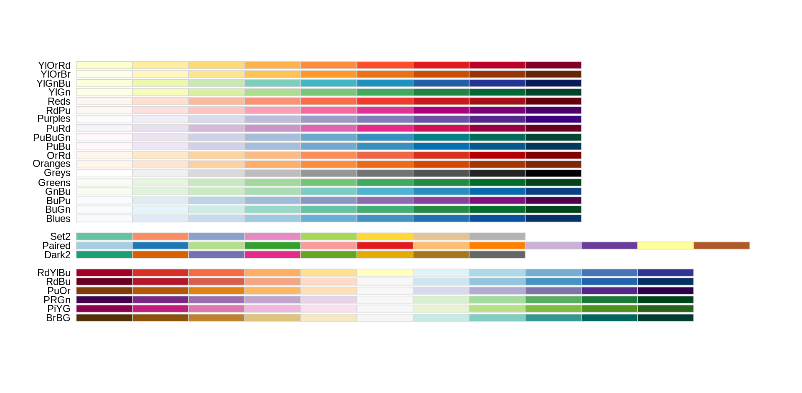

We start by loading the required packages. `ggplot2` is included in the `tidyverse` package.

~~~
library(tidyverse)
library(palmerpenguins)
~~~
{: .language-r}

If not still in the workspace, load the data we saved in the previous lesson.

~~~
data(penguins)

# alternatively, we can load our csv's
penguins_comp <- read_csv("data/penguins_complete.csv")
penguins_raw_comp <- read_csv("data/penguins_raw_complete.csv")
~~~
{: .language-r}

## Plotting with ggplot2

`ggplot2` is a plotting package that provides helpful commands to create complex plots from data in a data frame. It provides a more programmatic interface for specifying what variables to plot, how they are displayed, and general visual properties. Therefore, we only need minimal changes if the underlying data change or if we decide to change from a bar plot to a scatterplot. This helps in creating publication quality plots with minimal amounts of adjustments and tweaking.

`ggplot2` refers to the name of the package itself. When using the package we use the function `ggplot()` to generate the plots, and so references to using the function will be referred to as `ggplot()` and the package as a whole as `ggplot2`

`ggplot2` plots work best with data in the ‘long’ format, i.e., a column for every variable, and a row for every observation. Well-structured data will save you lots of time when making figures with `ggplot2`

ggplot graphics are built layer by layer by adding new elements. Adding layers in this fashion allows for extensive flexibility and customization of plots.

To build a ggplot, we will use the following basic template that can be used for different types of plots:

~~~
# this will not run
ggplot(data = <DATA>, mapping = aes(<MAPPINGS>)) +  <GEOM_FUNCTION>()
~~~
{: .language-r}

* use the `ggplot()` function and bind the plot to a specific data frame using the data argument

~~~
ggplot(data = penguins)
~~~
{: .language-r}

* define an aesthetic mapping (using the aesthetic (aes) function), by selecting the variables to be plotted and specifying how to present them in the graph, e.g., as x/y positions or characteristics such as size, shape, color, etc.

~~~
ggplot(data = penguins_comp, mapping = aes(x = body_mass_g, y = flipper_length_mm))
~~~
{: .language-r}

* add ‘geoms’ – graphical representations of the data in the plot (points, lines, bars). `ggplot2` offers many different geoms; we will use some common ones today, including:
  * `geom_point()` for scatter plots, dot plots, etc.
  * `geom_boxplot()` for, well, boxplots!
  * `geom_line()` for trend lines, time series, etc.

To add a geom to the plot use `+` operator. Because we have two continuous variables, let’s use `geom_point()` first:

~~~
ggplot(data = penguins_comp, aes(x = body_mass_g, y = flipper_length_mm)) +
  geom_point()
~~~
{: .language-r}

The + in the `ggplot2` package is particularly useful because it allows you to modify existing ggplot objects. This means you can easily set up plot “templates” and conveniently explore different types of plots, so the above plot can also be generated with code like this:

~~~
# Assign plot to a variable
penguins_plot <- ggplot(data = penguins_comp,
                       mapping = aes(x = body_mass_g, y = flipper_length_mm))

# Draw the plot
penguins_plot +
  geom_point()
~~~
{: .language-r}

**Notes**

* Anything you put in the `ggplot()` function can be seen by any geom layers that you add (i.e., these are universal plot settings). This includes the x- and y-axis you set up in aes().
* You can also specify aesthetics for a given geom independently of the aesthetics defined globally in the `ggplot()` function.
* The + sign used to add layers must be placed at the end of each line containing a layer. If, instead, the + sign is added in the line before the other layer, `ggplot2` will not add the new layer and will return an error message.
* You may notice that we sometimes reference ‘`ggplot2`’ and sometimes ‘ggplot’. To clarify, ‘`ggplot2`’ is the name of the most recent version of the package. However, any time we call the function itself, it’s just called ‘ggplot’.
* The previous version of the `ggplot2` package, called ggplot, which also contained the `ggplot()` function is now unsupported and has been removed from CRAN in order to reduce accidental installations and further confusion.

~~~
# This is the correct syntax for adding layers
penguins_plot +
  geom_point()

# This will not add the new layer and will return an error message
penguins_plot
+ geom_point()
~~~
{: .language-r}

> ## Challenge
> Scatter plots can be useful exploratory tools for small datasets. 
> For data sets with large numbers of observations, such as the surveys_complete data set, overplotting of points can be a limitation of scatter plots. 
> One strategy for handling such settings is to use hexagonal binning of observations. 
> The plot space is tessellated into hexagons. 
> Each hexagon is assigned a color based on the number of observations that fall within its boundaries. 
> To use hexagonal binning with `ggplot2`, first install the R package hexbin from CRAN:
> ~~~
> install.packages("hexbin")
> library(hexbin)
> ~~~
> {: .language-r}
> 
> Then use the `geom_hex()` function:
> ~~~
> penguins_plot +
>   geom_hex()
> ~~~
> {: .language-r}
> What are the relative strengths and weaknesses of a hexagonal bin plot compared to a scatter plot? 
> Examine the above scatter plot and compare it with the hexagonal bin plot that you created.
> 
{: .challenge}

## Building your plots iteratively

Building plots with `ggplot2` is typically an iterative process. We start by defining the dataset we’ll use, lay out the axes, and choose a geom:

~~~
ggplot(data = penguins_comp, aes(x = body_mass_g, y = flipper_length_mm)) + geom_point()
~~~
{: .language-r}

Then, we start modifying this plot to extract more information from it. For instance, we can add transparency (alpha) to avoid overplotting:

~~~
ggplot(data = penguins_comp, aes(x = body_mass_g, y = flipper_length_mm)) +
  geom_point(alpha = 0.1)
~~~
{: .language-r}

We can also add colors for all the points:

~~~
ggplot(data = penguins_comp, mapping = aes(x = body_mass_g, y = flipper_length_mm)) +
  geom_point(alpha = 0.1, color = "blue")
~~~
{: .language-r}

Or to color each species in the plot differently, you could use a vector as an input to the argument color. `ggplot2` will provide a different color corresponding to different values in the vector. Here is an example where we color with species_id:

~~~
ggplot(data = penguins_comp, mapping = aes(x = body_mass_g, y = flipper_length_mm)) +
  geom_point(alpha = 0.1, aes(color = species))
~~~
{: .language-r}

## Colors are a Tool

Different data scales benefit from different palettes.
We will generally find three palettes:

Qualitative -- when the data does not have an order of magnitude, so each color is distinct.
This is appropriate for visualizations with categorical variables that are unrelated to one each other.

Sequential -- when data values are measured along a sequential scale, such as values range from low to high, 0 to 5 stars, or centrality scores between 0 to 1.

Divergent -- If variables sit on a spectrum, where we have two "extremes" and a "neutral" or pivotal value in the middle, such as cold to hot.
Data represented by a divergent palette uses one color on one end of the spectrum and a visually different, distinct color on the other end.
A visually neutral color is used in the middle.

These pallettes are made available by the package "RColorBrewer".

## Boxplot
We can use boxplots to visualize the distribution of body mass within each species:

~~~
ggplot(data = penguins_comp, mapping = aes(x = species, y = body_mass_g)) +
  geom_boxplot()
~~~
{: .language-r}

By adding points to the boxplot, we can have a better idea of the number of measurements and of their distribution:

~~~
ggplot(data = penguins_comp, mapping = aes(x = species, y = body_mass_g)) +
  geom_boxplot(alpha = 0) +
  geom_jitter(alpha = 0.3, color = "tomato")
~~~
{: .language-r}

Notice how the boxplot layer is behind the jitter layer? What do you need to change in the code to put the boxplot in front of the points such that it’s not hidden?

> ## Challenges
> Boxplots are useful summaries, but hide the shape of the distribution.
> For example, if there is a bimodal distribution, it would not be observed with a boxplot. 
> An alternative to the boxplot is the violin plot (sometimes known as a beanplot), where the shape (of the density of points) is drawn.
> 
> Replace the box plot with a violin plot; see `geom_violin()`.
> Try making a new plot to explore the distribution of another variable within each species.
> 
> Some suggested explorations:
> - Create boxplot for `flipper_length_mm`. 
> Overlay the boxplot layer on a jitter layer to show actual measurements.
> 
> - Add color to the data points on your boxplot according to the plot from which the observation was located (`island`).
> Hint: Check the class for `island`. 
> 
> > ## Solution
> > 
> > In this plot, we see the outline of a shape that fits the distribution of points.
> > 
> > ~~~
> > ggplot(data = penguins_comp, mapping = aes(x = species, y = > > body_mass_g)) +
> >   geom_violin(alpha = 0) +
> >   geom_jitter(alpha = 0.3, color = "tomato")
> > ~~~
> > {: .language-r}
> > 
> {: .solution}
{: .challenge}

## Plotting time series data

Let’s calculate number of counts per day (in the month of November, 2008) for each species. First we need to group the data and count records within each group:

~~~
library(lubridate)
?penguins_raw
~~~
{: .language-r}

~~~
penguins_raw_subset <- penguins_raw_comp %>%
  select("Island", "Species", "Date Egg") %>%
  filter(year(penguins_raw_complete[["Date Egg"]]) == 2008) %>%
  rename(date_egg = "Date Egg")
~~~
{: .language-r}

~~~
daily_counts <- penguins_raw_subset %>%
  count(date_egg, Species)

View(daily_counts)
~~~
{: .language-r}

Timelapse data can be visualized as a line plot with years on the x-axis and counts on the y-axis:

~~~
ggplot(data = daily_counts, aes(x = date_egg, y = n)) +
  geom_line()
~~~
{: .language-r}

Unfortunately, this does not work because we plotted data for all the `species` together. We need to tell ggplot to draw a line for each `species` by modifying the aesthetic function to include group = `species`:

~~~
ggplot(data = daily_counts, aes(x = date_egg, y = n, group = Species)) +
  geom_line()
~~~
{: .language-r}

We will be able to distinguish `species` in the plot if we add colors (using color also automatically groups the data):

~~~
ggplot(data = daily_counts, aes(x = date_egg, y = n, color = Species)) +
  geom_line()
~~~
{: .language-r}

## Integrating the pipe operator with ggplot2
In the previous lesson, we saw how to use the pipe operator %>% to use different functions in a sequence and create a coherent workflow. We can also use the pipe operator to pass the data argument to the `ggplot()` function. The hard part is to remember that to build your ggplot, you need to use + and not %>%.

~~~
daily_counts %>%
  ggplot(mapping = aes(x = date_egg, y = n, color = Species)) +
  geom_line()
~~~
{: .language-r}

The pipe operator can also be used to link data manipulation with consequent data visualization.

~~~
daily_counts_graph <- peng_raw_subset %>%
  count(date_egg, Species) %>%
  ggplot(mapping = aes(x = date_egg, y = n, color = Species)) +
  geom_line()

daily_counts_graph
~~~
{: .language-r}

## Faceting
ggplot has a special technique called faceting that allows the user to split one plot into multiple plots based on a factor included in the dataset. We will use it to look at the bill features of each species:

~~~
ggplot(data = penguins, aes(x = bill_length_mm, y = bill_depth_mm, color = species)) +
  geom_point() +
  facet_wrap(facets = vars(sex))
~~~
{: .language-r}

Notice how the Nan values of sex shows up on our plot. Le'ts create a new dataframe to exclude those points, and look at the plot again.

~~~
penguins_complete <- penguins %>%
  filter(!is.na(sex))
~~~
{: .language-r}

~~~
ggplot(data = penguins_complete, aes(x = bill_length_mm, y = bill_depth_mm, color = species)) +
  geom_point() +
  facet_wrap(facets = vars(sex))
~~~
{: .language-r}

We can also facet both by sex and island:

~~~
ggplot(data = penguins_complete,
       mapping = aes(x = bill_length_mm, y = bill_depth_mm, color = species)) +
  geom_point() +
  facet_grid(rows = vars(sex), cols =  vars(island))
~~~
{: .language-r}

You can also organise the panels only by rows (or only by columns):

~~~
# One column, facet by rows
ggplot(data = penguins_complete,
       mapping = aes(x = bill_length_mm, y = bill_depth_mm, color = species)) +
  geom_point() +
  facet_grid(rows = vars(island))
~~~
{: .language-r}

~~~
# One row, facet by column
ggplot(data = penguins_complete,
       mapping = aes(x = bill_length_mm, y = bill_depth_mm, color = species)) +
  geom_point() +
  facet_grid(cols = vars(island))
~~~
{: .language-r}

## ggplot2 themes
Usually plots with white background look more readable when printed. Every single component of a ggplot graph can be customized using the generic theme() function, as we will see below. However, there are pre-loaded themes available that change the overall appearance of the graph without much effort.

For example, we can change our previous graph to have a simpler white background using the theme_bw() function:

~~~
ggplot(data = penguins_complete,
       mapping = aes(x = species, fill = sex)) +
  geom_bar(position = "dodge") +
  scale_fill_brewer(palette = "Set2") +
  facet_grid(cols = vars(island)) + 
  labs(title = "Species Count over Islands",
       x = "Penguin Species",
       y = "Number of individuals") +
  theme_bw() 
~~~
{: .language-r}

In addition to theme_bw(), which changes the plot background to white, ggplot2 comes with several other themes which can be useful to quickly change the look of your visualization. The complete list of themes is available at [https://ggplot2.tidyverse.org/reference/ggtheme.html](https://ggplot2.tidyverse.org/reference/ggtheme.html). `theme_minimal()` and `theme_light()` are popular, and `theme_void()` can be useful as a starting point to create a new hand-crafted theme.

The [ggthemes](https://ggplot2.tidyverse.org/reference/ggtheme.html) package provides a wide variety of options.

> ## Challenge
> Use what you just to create a plot that depicts the count of each species, delineated by sex, at each island.
> 
> > ## (A) Solution
> > ~~~
> > ggplot(data = penguins_complete,
> >        mapping = aes(x = species, fill = sex)) +
> >   geom_bar(position = "dodge") +
> >   scale_fill_brewer(palette = "Set2") +
> >   facet_grid(cols = vars(island))
> > ~~~
> > {: .language-r}
> {: .solution}
{: .challenge}

## Customization
Take a look at the [ggplot2 cheat sheet](https://raw.githubusercontent.com/rstudio/cheatsheets/main/data-visualization-2.1.pdf), and think of ways you could improve the plot.

Now, let’s change names of axes to something more informative and add a title to the figure:

~~~
ggplot(data = penguins_complete,
       mapping = aes(x = species, fill = sex)) +
  geom_bar(position = "dodge") +
  scale_fill_brewer(palette = "Set2") +
  facet_grid(cols = vars(island)) + 
  labs(title = "Species Count over Islands",
       x = "Penguin Species",
       y = "Number of individuals") +
  theme_bw()
~~~
{: .language-r}

The axes have more informative names, but their readability can be improved by increasing the font size. This can be done with the generic theme() function:

~~~
ggplot(data = penguins_complete,
       mapping = aes(x = species, fill = sex)) +
  geom_bar(position = "dodge") +
  scale_fill_brewer(palette = "Set2") +
  facet_grid(cols = vars(island)) + 
  labs(title = "Species Count over Islands",
       x = "Penguin Species",
       y = "Number of individuals") +
  theme_bw() + 
  theme(text=element_text(size = 12))
~~~
{: .language-r}

Note that it is also possible to change the fonts of your plots. If you are on Windows, you may have to install the [extrafont package](https://github.com/wch/extrafont), and follow the instructions included in the README for this package.

After our manipulations, you may notice that the values on the x-axis are still not properly readable. Let’s change the orientation of the labels and adjust them vertically and horizontally so they don’t overlap. You can use a 90 degree angle, or experiment to find the appropriate angle for diagonally oriented labels. We can also modify the facet label text `(strip.text)` to italicize the species names:

~~~
ggplot(data = penguins_complete,
       mapping = aes(x = species, fill = sex)) +
  geom_bar(position = "dodge") +
  scale_fill_brewer(palette = "Set2") +
  facet_grid(cols = vars(island)) + 
  labs(title = "Species Count over Islands",
     x = "Penguin Species",
     y = "Number of individuals") +
  theme(axis.text.x = element_text(colour = "grey20", size = 12, angle = 90, hjust = 0.5, vjust = 0.5),
        axis.text.y = element_text(colour = "grey20", size = 12),
        strip.text = element_text(face = "italic"), 
        panel.background = element_rect(fill = "white", color= "grey"),
        text = element_text(size = 12))
~~~
{: .language-r}

If you like the changes you created better than the default theme, you can save them as an object to be able to easily apply them to other plots you may create:

~~~
grey_theme <- theme(axis.text.x = element_text(colour = "grey20", size = 12, angle = 90, hjust = 0.5, vjust = 0.5), 
                      axis.text.y = element_text(colour = "grey20", size = 12),
                      strip.text = element_text(face = "italic"), 
                      panel.background = element_rect(fill = "white", color= "grey"),
                      text = element_text(size = 12))
~~~
{: .language-r}

~~~
ggplot(data = penguins_complete,
       mapping = aes(x = bill_length_mm, y = bill_depth_mm, color = species)) +
  geom_point() +
  facet_grid(cols = vars(island)) +
  grey_theme
~~~
{: .language-r}

> ## Challenge
> With all of this information in hand, please take another five minutes to either improve one of the plots generated in this exercise or create an informative graph of your own. Use the RStudio ggplot2 cheat sheet for inspiration.
> 
> Here are some ideas:
> 
> See if you can change the shape of the points.
> Can you find a way to change the name of the legend? What about its labels?
> Try using a different color palette (see [https://www.cookbook-r.com/Graphs/Colors_(ggplot2)/)](https://www.cookbook-r.com/Graphs/Colors_(ggplot2)/).
{: .challenge}

## Exporting plots
After creating your plot, you can save it to a file in your favorite format. The Export tab in the Plot pane in RStudio will save your plots at low resolution, which will not be accepted by many journals and will not scale well for posters. The [ggplot2 extensions website](https://exts.ggplot2.tidyverse.org/) provides a list of packages that extend the capabilities of `ggplot2`, including additional themes.

Instead, use the `ggsave()` function, which allows you to easily change the dimension and resolution of your plot by adjusting the appropriate arguments (`width`, `height` and `dpi`):

~~~
island_counts <- ggplot(data = penguins_complete,
                  mapping = aes(x = species, fill = sex)) +
  geom_bar(position = "dodge") +
  scale_fill_brewer(palette = "Set2") +
  facet_grid(cols = vars(island)) + 
  labs(title = "Species Count over Islands",
       x = "Penguin Species",
       y = "Number of individuals") +
  grey_theme
~~~
{: .language-r}

~~~
ggsave("island_counts.png", island_counts, width = 10, dpi = 300)
~~~
{: .language-r}

Note: The parameters width and height also determine the font size in the saved plot.


